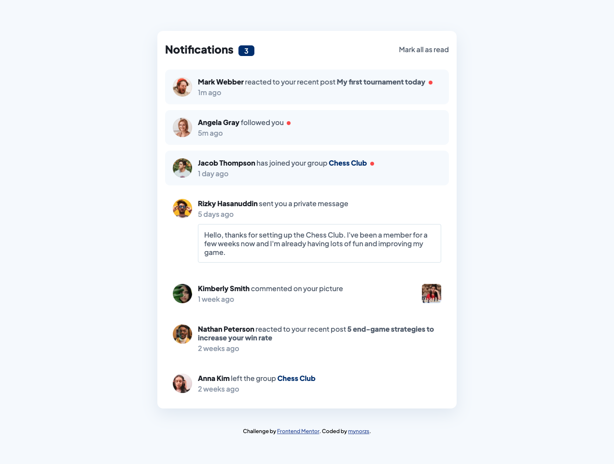

# Frontend Mentor - Notifications page solution

This is a solution to the [Notifications page challenge on Frontend Mentor](https://www.frontendmentor.io/challenges/notifications-page-DqK5QAmKbC). Frontend Mentor challenges help you improve your coding skills by building realistic projects. 

## Table of contents

- [Overview](#overview)
  - [The challenge](#the-challenge)
  - [Screenshot](#screenshot)
  - [Links](#links)
- [My process](#my-process)
  - [Built with](#built-with)
  - [What I learned](#what-i-learned)
  - [Continued development](#continued-development)
- [Author](#author)

**Note: Delete this note and update the table of contents based on what sections you keep.**

## Overview

### The challenge

Users should be able to:

- Distinguish between "unread" and "read" notifications
- Select "Mark all as read" to toggle the visual state of the unread notifications and set the number of unread messages to zero
- View the optimal layout for the interface depending on their device's screen size
- See hover and focus states for all interactive elements on the page

### Screenshot

### Links

- Live Site URL: [Add live site URL here](https://mynorzs.github.io/notifications-page/)

## My process

### Built with

- Semantic HTML5 markup
- CSS custom properties
- Flexbox
- Javascript

### What I learned

In this lesson I practice how to loop through DOM elements and make buttons interactive inside that loop, instead of creating a bunch of JS variables for each of the seven notification items. I tried to do it this way, because I want to be able to make more interactive websites that will eventually call information from another source.

### Continued development

Next I want to make a more complete website or game that pushes me to research more advanced JS or even using an API.

## Author

- Website - [Add your name here](https://mynorzuniga.myportfolio.com/.com)
- Frontend Mentor - [@yourusername](https://www.frontendmentor.io/profile/mynorzs)